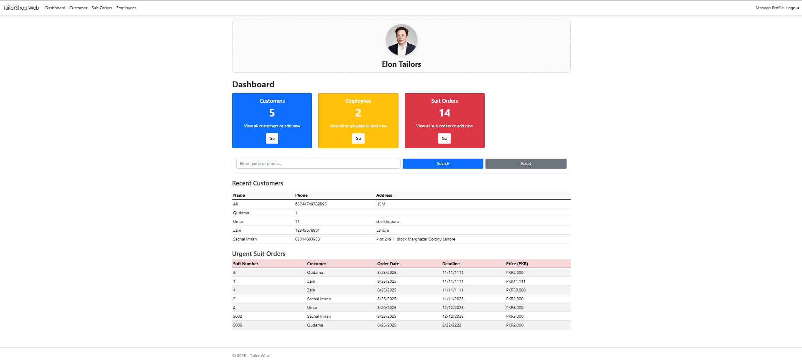
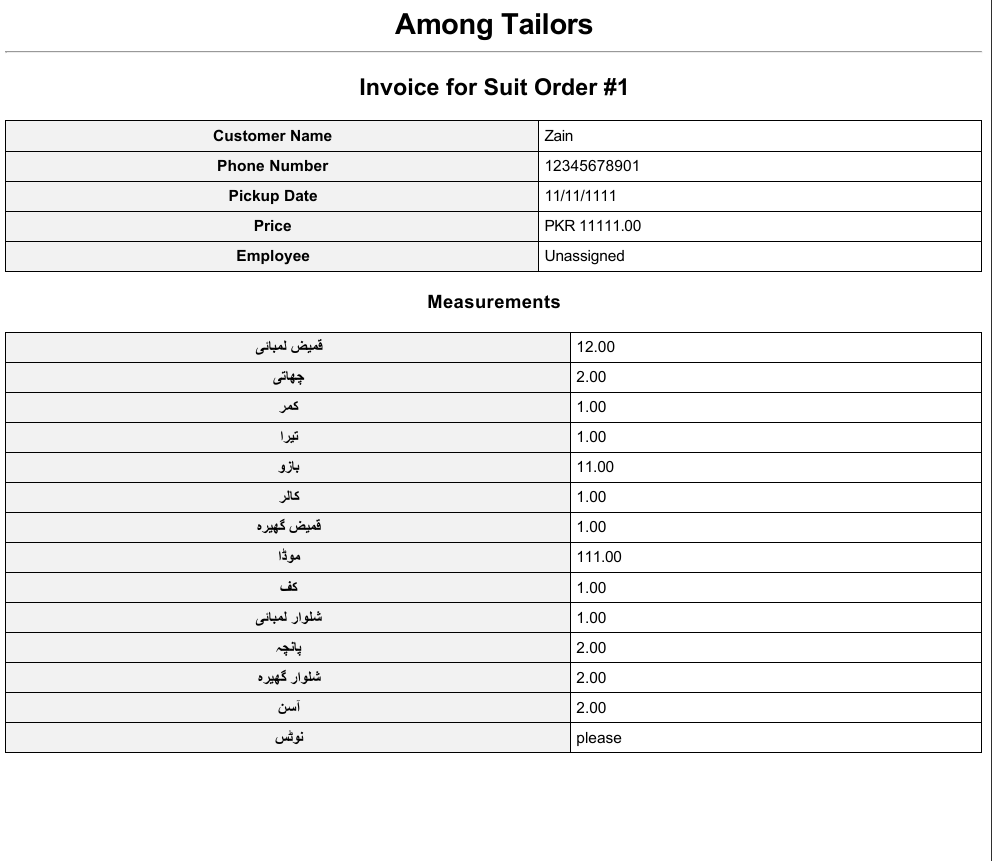

# ✂️ Tailor Management System

> Manage tailor shop orders, customers, employees, and invoices with your own brand identity.

A modern web-based application to help tailor shops manage daily operations.
This repository is a **public showcase** (README + screenshots).
👉 The **complete source code** lives in a **private repository**.

---

## 🔑 Two‑Repo Setup (How this project is organized)

* **Private repo (real code)**: `tailor-app-code` – contains the full ASP.NET Core solution, EF Core models, controllers, views, and assets. Only the owner/collaborators can access it.
* **Public repo (showcase)**: `tailor-app` – contains this `README.md`, screenshots, and documentation so people can see the project exists without exposing the code.

> If you’re interested in the source, please reach out to request access to the private repository.

---

## 🚀 Feature Highlights

* **Individual Accounts** – Each user/shop owner logs in to their own account; data remains isolated per account.
* **Brand Identity** – Add and edit your **shop name** and **logo**; branding appears on the dashboard and on invoices.
* **Customer Management** – Maintain customer profiles with full measurement records.
* **Employee Management** – Track employee details and their assigned orders.
* **Suit Orders** – Create orders with suit number, customer, measurements, assigned employee, and due date.
* **Urgent Orders** – Near‑deadline orders are highlighted and surfaced to the top.
* **Invoices** – Generate professional invoices including customer details, measurements, shop branding, and order meta.
* **Invoice Printing / PDF** – Print invoices directly or export/download as PDF and from Microsoft Edge or ant other app you can directly print it.
* **Dashboard KPIs** – Quick stats for **customers**, **employees**, and **suit orders**.
* **Search & Filters** – Quickly find customers, employees and suit orders.
* **Secure Auth** – Built on ASP.NET Core Identity.

---

## 🛠 Tech Stack

* **ASP.NET Core MVC** (C#)
* **Entity Framework Core** (SQL Server)
* **Bootstrap / CSS**

---

## 📸 Application Screenshots

### Gallery (Grid)

<table>
  <tr>
    <td align="center">
      <strong>Dashboard</strong> 
      
    </td>
    <td align="center">
      <strong>Suit Orders</strong> 
      
    </td>
  </tr>
  <tr>
    <td align="center">
      <strong>Invoice (With Branding)</strong> 
      
    </td>
    <td align="center">
      <strong>User Profile & Branding</strong> 
      
    </td>
    <td align="center">
      <strong>User Profile & Branding</strong> 
      
    </td>
  </tr>
</table>

---

## 🔒 Source Code & Access

This repository does **not** contain the application source code.
The production codebase is maintained in a **private GitHub repository** to protect IP and sensitive logic.
For demo access, collaboration, or code review requests, please contact the maintainer below.

---

## 📄 Invoices – Print & PDF

* A **Download as PDF** option is available to save/share/print invoices digitally.
* Invoices render your **shop name and logo** automatically (from your branding settings).

> If you need thermal/receipt‑style output or custom paper sizes, open an issue in this public repo and we’ll add the specs.

---

## 🧭 Roadmap (Public)

* Public demo video / GIF preview
* More screenshots (Orders detail, Urgent queue, Measurements form)
* Multi‑language labels (Urdu/English)

---

## 📩 Contact
- **Maintainer:** Muhammad Sachal  
- **Email:** [sachalm58@gmail.com](mailto:sachalm58@gmail.com)  
- **Website:** [sachal-portfolio.onrender.com](https://sachal-portfolio.onrender.com/)  
- **GitHub:** [github.com/Sachal2508](https://github.com/Sachal2508)  
- **LinkedIn:** [Muhammad Sachal](https://www.linkedin.com/in/muhammad-sachal-9a929136a/)  

---

## 📝 Notes

* No license is included in this public repo because it does not ship source code.
