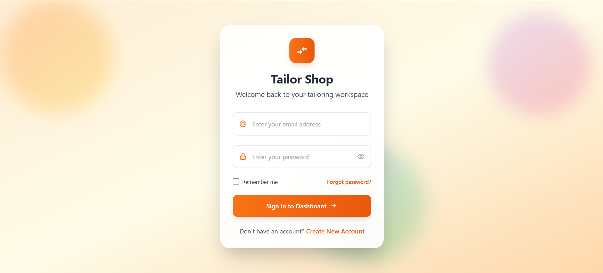
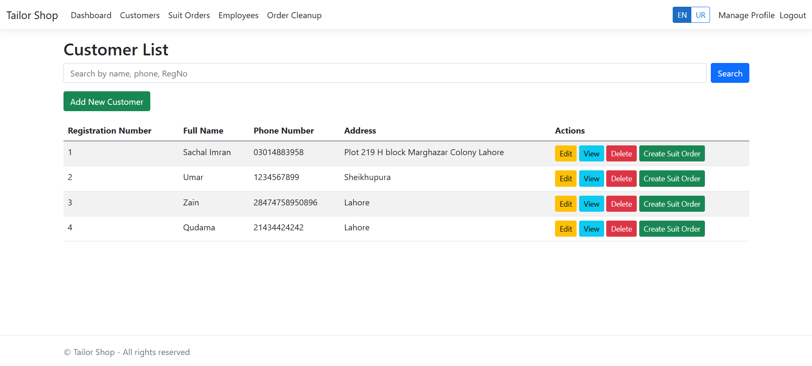
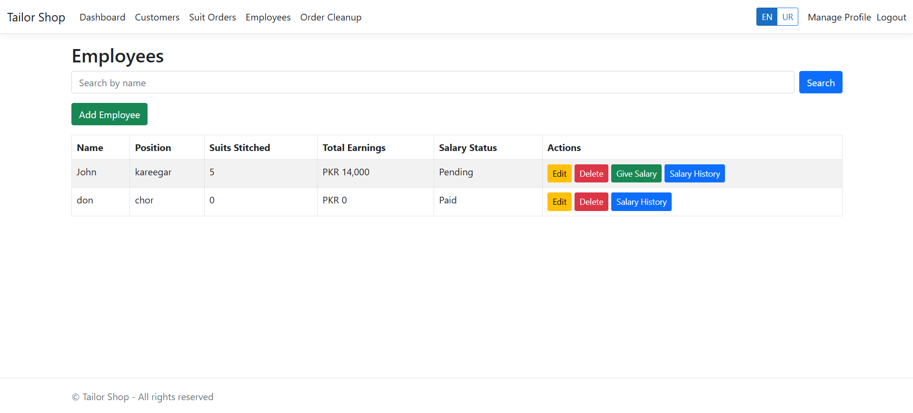
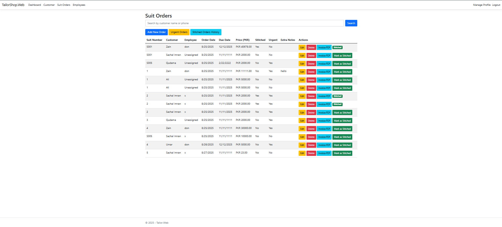
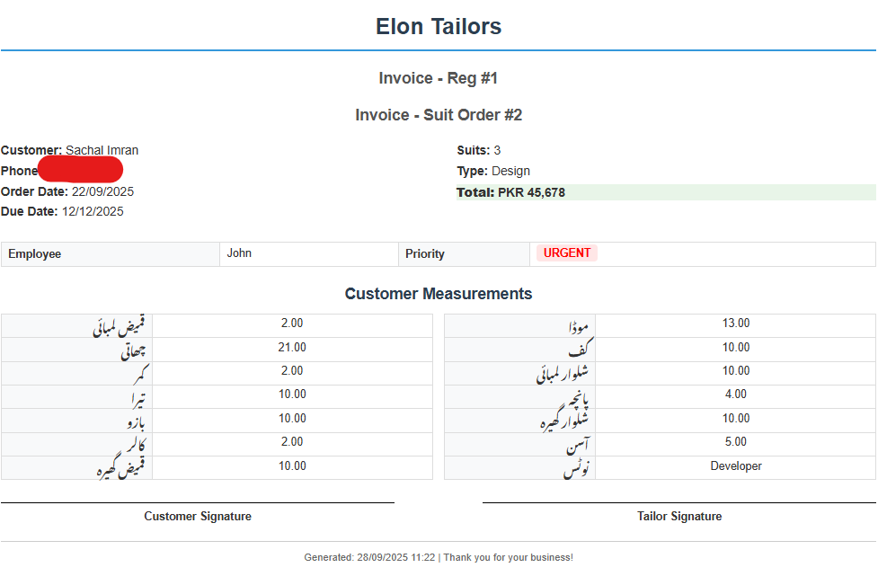

# ✂️ Tailor Management System

> Comprehensive tailor shop management with multi-language support, automated workflows, and professional invoicing.

A modern web-based application to help tailor shops manage daily operations with built-in automation and bilingual support.
This repository is a **public showcase** (README + screenshots).
👉 The **complete source code** lives in a **private repository**.

---

## 🔑 Two‑Repo Setup (How this project is organized)

* **Private repo (real code)**: `tailor-app-code` – contains the full ASP.NET Core solution, EF Core models, controllers, views, and assets. Only the owner/collaborators can access it.
* **Public repo (showcase)**: `tailor-app` – contains this `README.md`, screenshots, and documentation so people can see the project exists without exposing the code.

> If you're interested in the source, please reach out to request access to the private repository.

---

## 🚀 Feature Highlights

### 🔐 **Authentication & Security**
* **Secure Registration/Login** – Full ASP.NET Core Identity integration
* **Forgot Password with OTP** – Email-based password recovery with time-limited OTP codes
* **Email Verification** – SendGrid integration for reliable email delivery
* **Password Reset** – Secure token-based password reset workflow

### 🌍 **Multi-Language Support**
* **English/Urdu Toggle** – Seamless language switching throughout the application
* **Localized UI** – Complete interface translation for both languages
* **Cultural Formatting** – Proper date, number, and currency formatting per locale

### 👤 **User Management**
* **Individual Accounts** – Each user/shop owner logs in to their own account; data remains isolated per account
* **Brand Identity** – Add and edit your **shop name** and **logo**; branding appears on the dashboard and invoices
* **Profile Management** – Complete user profile customization

### 👥 **Customer & Employee Management**
* **Customer Profiles** – Comprehensive customer database with full measurement records
* **Employee Management** – Track employee details, assignments, and work history
* **Employee History** – Complete audit trail of employee activities and order assignments
* **Advanced Search & Filtering** – Quickly find customers and employees with powerful search tools

### 📋 **Order Management**
* **Suit Orders** – Create detailed orders with suit numbers, measurements, assignments, and due dates
* **Urgent Orders Dashboard** – Near-deadline orders automatically highlighted and prioritized
* **Order Status Tracking** – Real-time status updates throughout the tailoring process
* **Mark Orders as Received** – Track order completion and customer pickup
* **Received Orders History** – Complete history of completed and delivered orders

### 🧹 **Automated Maintenance**
* **Order Cleanup Service** – Background service automatically archives old completed orders
* **Data Retention Policies** – Configurable retention periods for different data types
* **Performance Optimization** – Automatic database cleanup maintains system performance

### 📊 **Analytics & Reporting**
* **Dashboard KPIs** – Real-time statistics for customers, employees, and suit orders
* **Visual Analytics** – Graphs and charts showing business trends
* **Order Analytics** – Track completion rates, urgent orders, and employee performance

### 🧾 **Professional Invoicing**
* **Branded Invoices** – Generate professional invoices with your shop branding
* **Invoice Printing/PDF** – Direct printing or PDF export/download capability
* **Customer Integration** – Invoices automatically include customer details and measurements
* **Order Meta Integration** – Complete order information embedded in invoices

### ⚡ **Advanced Features**
* **Real-time Updates** – Live dashboard updates without page refresh
* **Responsive Design** – Works perfectly on desktop, tablet, and mobile devices
* **Data Export** – Export customer, employee, and order data
* **Backup & Restore** – Built-in data protection features

---

## 🛠 Tech Stack

* **ASP.NET Core MVC** (C#) - Backend framework
* **Entity Framework Core** - Database ORM with MySQL/PostgreSQL support
* **ASP.NET Core Identity** - Authentication and authorization
* **SendGrid** - Email service integration
* **Bootstrap 5** - Responsive UI framework
* **JavaScript/jQuery** - Frontend interactivity
* **Chart.js** - Data visualization
* **Localization** - Multi-language support infrastructure

---

## 📸 Application Screenshots

### Authentication Flow
<table>
  <tr>
    <td align="center">
      <strong>Sign In</strong> 
      
    </td>
    <td align="center">
      <strong>Login</strong> 
      
    </td>
    <td align="center">
      <strong>Forgot Password</strong> 
      
    </td>
  </tr>
  <tr>
    <td align="center">
      <strong>Verify OTP</strong> 
      
    </td>
    <td align="center">
      <strong>Email Notification</strong> 
      
    </td>
    <td align="center">
      <strong></strong> 
    </td>
  </tr>
</table>

### Main Dashboard & Language Support
<table>
  <tr>
    <td align="center">
      <strong>Dashboard (English)</strong> 
      
    </td>
    <td align="center">
      <strong>Dashboard (Urdu)</strong> 
      
    </td>
  </tr>
</table>

### Customer & Employee Management
<table>
  <tr>
    <td align="center">
      <strong>Customers</strong> 
      
    </td>
    <td align="center">
      <strong>Customer Details</strong> 
      
    </td>
  </tr>
  <tr>
    <td align="center">
      <strong>Employees</strong> 
      
    </td>
    <td align="center">
      <strong>Employee History</strong> 
      
    </td>
  </tr>
</table>

### Order Management System
<table>
  <tr>
    <td align="center">
      <strong>Suit Orders</strong> 
      
    </td>
    <td align="center">
      <strong>Urgent Orders</strong> 
      
    </td>
  </tr>
  <tr>
    <td align="center">
      <strong>Mark as Received</strong> 
      
    </td>
    <td align="center">
      <strong>Received Orders History</strong> 
      
    </td>
  </tr>
  <tr>
    <td align="center">
      <strong>Order Cleanup</strong> 
      
    </td>
    <td align="center">
      <strong>Professional Invoice</strong> 
      
    </td>
  </tr>
</table>

---

## 🌟 Key Differentiators

* **Full Bilingual Support** - Complete English/Urdu interface with proper RTL support
* **Email Integration** - Professional email notifications with OTP verification
* **Automated Cleanup** - Background services maintain optimal system performance
* **Smart Prioritization** - Urgent orders automatically surface to prevent missed deadlines
* **Professional Branding** - Custom shop branding on all customer-facing materials
* **Comprehensive Audit Trail** - Complete history tracking for all operations

---

## 🔒 Source Code & Access

This repository does **not** contain the application source code.
The production codebase is maintained in a **private GitHub repository** to protect IP and sensitive logic.
For demo access, collaboration, or code review requests, please contact the maintainer below.

---

## 📄 Invoices – Print & PDF

* **Download as PDF** option available for digital sharing and archival
* **Direct Printing** capability for immediate physical copies
* **Automatic Branding** - Your shop name and logo appear on all invoices
* **Complete Order Details** - Customer measurements, order specifications, and pricing

> Custom thermal/receipt printing and specialized paper sizes can be implemented on request.

---

## 🧭 Roadmap (Planned Features)

* **Mobile App** - Native iOS/Android companion app
* **SMS Notifications** - Customer order status updates via SMS
* **Inventory Management** - Fabric and material tracking
* **Financial Reports** - Advanced accounting and profit analysis
* **Multi-Shop Support** - Franchise/chain management capabilities
* **API Integration** - Third-party accounting software integration

---

## 📩 Contact
- **Maintainer:** Muhammad Sachal  
- **Email:** [sachalm58@gmail.com](mailto:sachalm58@gmail.com)  
- **Website:** [sachal-portfolio.onrender.com](https://sachal-portfolio.onrender.com/)  
- **GitHub:** [github.com/Sachal2508](https://github.com/Sachal2508)  
- **LinkedIn:** [Muhammad Sachal](https://www.linkedin.com/in/muhammad-sachal-9a929136a/)  

---

## 📝 License & Usage

* This public repository contains documentation and screenshots only
* Source code is proprietary and maintained in a private repository
* For licensing and commercial use inquiries, please contact the maintainer

---

## ⭐ Show Your Support

If you find this project interesting or useful, please consider:
- Giving it a star on GitHub
- Sharing it with others in the tailoring/retail industry
- Providing feedback or feature suggestions
- Reaching out for collaboration opportunities
